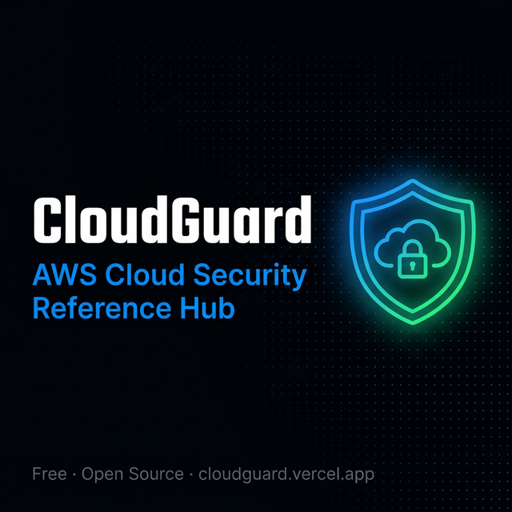
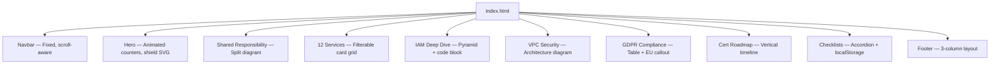

# 🛡️ CloudGuard — AWS Cloud Security Reference Hub

> A free, open-source reference guide covering AWS cloud security
> concepts, services, and GDPR compliance. Built for cloud learners,
> security professionals, and anyone preparing for AWS certifications.



## 🌐 Live → [cloudguard.vercel.app]((https://cloudguard-five.vercel.app/))

---

## ✨ What's Inside

| Section | Content |
|---------|---------|
| 🔄 Shared Responsibility | AWS vs Customer security boundaries |
| 🛡️ 12 Security Services | Every AWS security tool explained simply |
| 🔑 IAM Deep Dive | Identity management best practices |
| 🌐 VPC Security | Network architecture and protection layers |
| 🇪🇺 GDPR on AWS | European compliance guide for cloud |
| 🗺️ Cert Roadmap | Cloud Practitioner → Security Specialist path |
| ✅ Checklists | Actionable security checklists you can use today |

---

## 🏗️ Architecture & Design

### Why I Built This

Most AWS security resources are either:
- **Too complex** — written for senior architects, not learners
- **Too shallow** — one-paragraph definitions with no context
- **Scattered** — spread across 20+ AWS documentation pages

CloudGuard solves this by putting **everything you need in one page** — explained with real-world analogies, exam relevance ratings, and interactive checklists.

### How It's Built

```
cloudguard/
├── index.html          # Single file — ALL HTML, CSS, JS inline
├── favicon.svg         # Shield + cloud SVG icon
├── og-image.png        # Social sharing preview (1200×630)
├── README.md           # This file
├── LICENSE             # MIT
└── CONTRIBUTING.md     # Contribution guidelines
```

### Technical Decisions

| Decision | Rationale |
|----------|-----------|
| **Single HTML file** | Zero build process, instant deployment, no dependency rot |
| **Inline CSS** | No FOUC, one HTTP request, full design control |
| **Vanilla JS** | No framework overhead, <1KB total JS, works offline |
| **CSS Custom Properties** | Consistent design tokens, easy theming |
| **localStorage** | Checklist persistence without a backend |
| **Google Fonts** | Professional typography (Epilogue, Outfit, Fira Code) |
| **No frameworks** | Zero `node_modules`, zero build steps, zero maintenance |

### Design System

```
Color Palette:
├── Background:  #030508 (void) → #07090F (deep) → #0C1220 (card)
├── Primary:     #0088FF (electric blue)
├── Success:     #00C853 (secure green)
├── Alert:       #FF3D3D (danger red)
├── Amber:       #FFB300 (warning)
└── AWS Orange:  #FF9900

Typography:
├── Headlines:   Epilogue (800, 900)
├── Body:        Outfit (300–500)
└── Code:        Fira Code (400, 500)
```

### Component Architecture



### Interactive Features

| Feature | Implementation |
|---------|---------------|
| **Counter Animation** | IntersectionObserver triggers count-up on scroll |
| **Service Filters** | Data-attribute CSS class toggle (All/Identity/Detection/etc.) |
| **Checklist Persistence** | localStorage saves checked items per category |
| **Progress Bars** | Dynamic width calculation from checked/total ratio |
| **Accordion** | CSS display toggle with chevron rotation |
| **Scroll Animations** | IntersectionObserver adds `.visible` class for fade-in |
| **Navbar Blur** | `backdrop-filter: blur(20px)` on scroll > 50px |
| **Copy Policy** | `navigator.clipboard.writeText()` with visual feedback |

### Performance

- **0 dependencies** — no `package.json`, no `node_modules`
- **1 HTTP request** — single HTML file (everything inline)
- **~88KB total** — lighter than most hero images
- **No JavaScript frameworks** — pure DOM manipulation
- **Works offline** — after first load, everything is cached

---

## 🎯 Who This Is For

- AWS Cloud Practitioner exam candidates
- Cloud security learners and students
- IT professionals moving to cloud security
- European teams needing GDPR + AWS guidance
- Anyone who finds the official AWS docs overwhelming

---

## 🛠️ Tech Stack

- **Pure HTML** — Single file, zero dependencies
- **Vanilla CSS** — Custom properties, animations, responsive design
- **Vanilla JavaScript** — Counters, filters, localStorage checklists
- **Google Fonts** — Epilogue, Outfit, Fira Code
- **Zero build process** — Open `index.html` and it works

---

## 👤 Built By

**R Jan Steve Daniel** — Cloud Security Learner 🇮🇳

Currently preparing for AWS Cloud Practitioner.

[LinkedIn](https://www.linkedin.com/in/r-jan-steve-daniel-248630275) ·
[Portfolio](https://jan-steve-portfolio.vercel.app/) ·
[GitHub](https://github.com/JanSteve)

---

## 🤝 Contributing

Found something wrong? Want to add a service or checklist?
Open an issue or pull request — all contributions welcome!

See [CONTRIBUTING.md](CONTRIBUTING.md) for guidelines.

---

## 📄 License

MIT — Free forever. See [LICENSE](LICENSE).
